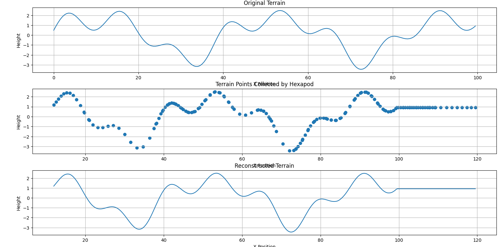

# Blind Spider Terrain Mapping

## Problem Statement

A blind hexapod robot reconstructs the terrain using only its leg joint angles and Forward Kinematics.

---

## Features

- Forward Kinematics of a 3-DOF hexapod leg
- Tripod gait simulation
- Terrain generation
- Ground contact detection
- Terrain reconstruction using cubic interpolation
- Terrain visualization

---

## Project Structure

```
BlindSpiderTerrainMapping/
│
├── main.py
├── kinematics.py
├── simulator.py
├── terrain.py
├── visualize.py
└── README.md
```

---

## Algorithm

1. Generate terrain.
2. Generate joint trajectories.
3. Compute Forward Kinematics.
4. Detect ground contact.
5. Collect terrain points.
6. Remove duplicate points.
7. Reconstruct terrain using cubic interpolation.
8. Visualize the results.

---

## Output

The program generates three plots:

- Original Terrain
- Sampled Contact Points
- Reconstructed Terrain
## Output


---

## Technologies Used

- Python
- NumPy
- SciPy
- Matplotlib
